# AlgoCore Technical Documentation
**Version 1.0 | April 2026**

## 1. Project Overview
AlgoCore is a comprehensive online examination and coding assessment platform. It provides a secure environment for conducting technical tests, including multiple-choice questions (MCQs), multi-select questions (MSQs), numeric/NAT questions, and live programming/SQL evaluations.

### Key Capabilities:
- **Dynamic Exam Engine**: Supports multiple question types with real-time state synchronization.
- **Sandboxed Code Execution**: Executes code in various languages (Python, JS, Java, C++, C, SQL) via a dedicated runner service.
- **Live Proctoring**: AI-assisted monitoring using camera streams and screen tracking, with automated violation detection.
- **Admin Dashboard**: Full Test-Life-Cycle management (creation, student enrollment, real-time monitoring, and results analysis).
- **Relational Backup**: Automated migration of NoSQL Firebase data to Azure SQL for structured reporting.

---

## 2. Technology Stack
| Layer | Technologies |
| :--- | :--- |
| **Frontend** | React 18, Next.js (App Router), Tailwind CSS, MUI, Framer Motion |
| **Authentication** | Firebase Auth (Google & Email/Password) |
| **Realtime DB** | Firebase Realtime Database (RTDB) |
| **Cloud Storage** | Azure Blob Storage (Profile photos, Video recordings) |
| **Compute/API** | Next.js Serverless Functions, Azure Container Apps (Runner) |
| **Backup DB** | Azure SQL Database |
| **AI/ML** | TensorFlow.js (COCO-SSD), OpenAI/Google AI (via Runner API) |
| **DevOps** | GitHub Actions, Docker (Code Runner) |

---

## 3. Project Structure & File Map

### Root Directory
- `/src/app`: Next.js App Router (Layouts, Pages, API Routes).
- `/src/components`: Primitive and shared UI components (e.g., `FloatingChatbot`, `Navbar`).
- `/src/context`: React Context providers for global state (Auth, Theme).
- `/src/views`: Main feature-specific pages (Admin, Exam, Profile).
- `/src/utils`: Utility functions (Email service, storage helpers).
- `/public`: Static assets like icons and logos.
- `/scripts`: Maintenance scripts (e.g., Azure SQL backups).
- `/images`: Screenshots and UI assets for documentation.

### Key Files
- `src/firebase.js`: Central Firebase SDK initialization (Auth & Database).
- `src/context/AuthContext.jsx`: Comprehensive auth management, session heartbeat, and security restrictions (Copy/Paste disable).
- `src/views/api.js`: Client-side connector for the external Code Runner & AI service.
- `database.rules`: Security and validation rules for Firebase Realtime Database.

---

## 4. API Documentation

### 4.1. Internal APIs (Next.js)
Located in `src/app/api/`.

| Endpoint | Method | Purpose |
| :--- | :--- | :--- |
| `/api/upload` | POST | Uploads files to Azure Blob Storage (e.g., Profile Photos). |
| `/api/proxy-blob` | GET | Proxies private Azure blobs to bypass CORS/Auth headers. |
| `/api/delete-blob` | DELETE | Cleans up storage containers. |
| `/api/upload-recording`| POST | Handles chunked WebM uploads for exam sessions. |
| `/api/convert-to-mp4` | POST | Triggers FFmpeg conversion of WebM recordings to MP4. |
| `/api/backup-azure-sql`| POST | Backs up Firebase collections to Azure SQL tables. |

### 4.2. External APIs (AlgoCore Runner)
Base URL: `https://algocore-runner.kindcliff-a86dac7a.southindia.azurecontainerapps.io/`

| Endpoint | Purpose | Payload |
| :--- | :--- | :--- |
| `/run` | Code Execution | `{ sourceCode, language, input }` |
| `/chat` | AI Chatbot | `{ messages: [...] }` |
| `/aptitude-solve` | Aptitude AI | `{ text: "Problem statement" }` |
| `/coding-evaluate` | Code Review | `{ text: "Source code" }` |
| `/coding-complexity` | Complexity Analysis | `{ text: "Source code" }` |
| `/ai` | Specialized Tasks | `{ task, text }` |

---

## 5. Firebase Architecture

### 5.1. Authentication
AlgoCore uses Firebase Authentication with two primary methods:
1. **Google Sign-In**: Synchronizes profile photo and email.
2. **Email/Password**: Traditional login for registered students.

**Session Management**:
- Implemented in `AuthContext.jsx`.
- **Heartbeat**: Updates `sessions/${uid}/${sessionId}/lastActive` every 45 seconds.
- **Single-Session Enforcement**: Detects if a user logs in from another device/browser and terminates the current session.
- **Security**: Disables Context Menu, Copy, Paste, and Selection for students during exams.

### 5.2. Data Structure (Realtime Database Schema)
The database is structured as a hierarchical NoSQL tree:

#### `/Users`
Stores core user identity and roles.
- `$uid`: `{ email, name, role (admin/student), profilePhoto, lastLogin }`

#### `/Exam` (Core Test Data)
- `$testId`:
  - `name`: Test title.
  - `duration`: Time in minutes.
  - `isVisible`: Whether students can see the test.
  - `allowedLanguages`: Array of enabled languages (e.g., `['python', 'sql']`).
  - `questions`: Object containing question definitions.
  - `Eligible`: Object mapping `{ name: email }` for enrolled students.
  - `configure`: `{ questionsPerType: { mcq, programming, ... } }`.
  - `proctorSettings`: `{ enableVideoProctoring, blockOnViolations, maxViolationCount }`.

#### `/ExamSubmissions` (Student Responses)
- `$testId`:
  - `$userId`: `{ [questionId]: { answer, startTime, endTime, type } }`

#### `/Marks` (Evaluation Data)
- `$testId`:
  - `$userId`: `{ totalScore, breakdown: { ... } }`

#### `/LiveProctoring` (Monitoring)
- `$testId`:
  - `$userId`: `{ cameraStream, screenStream, violations: [ { type, timestamp } ] }`

#### `/presence`
- `$uid`: `{ online: boolean, lastSeen: timestamp }`

#### `/Chat` & `/ChatRooms`
- Facilitates real-time communication between students and admins or within collaborate sessions.

---

## 6. Application Interface & Page Walkthrough

### 6.1. Student Portal
The student experience is designed for simplicity and focus during examinations and practice sessions.

| Page | Preview | Description |
| :--- | :--- | :--- |
| **Login** | 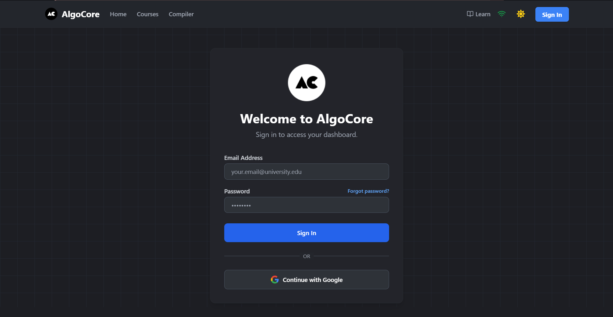 | The gateway to the platform, supporting Google OAuth and traditional credentials. |
| **User Profile** | 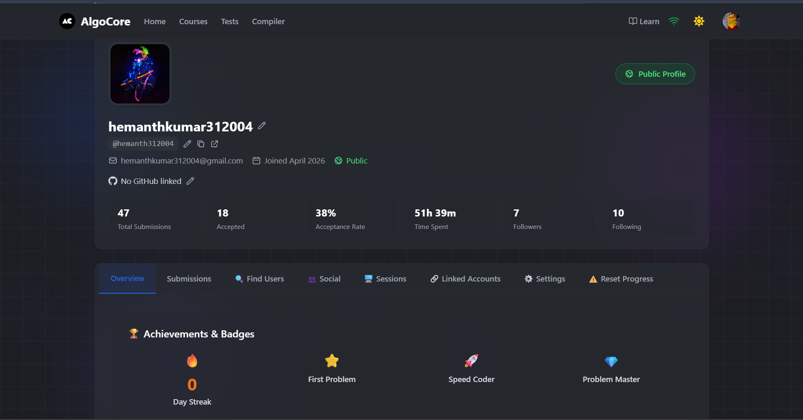 | Displays progress, enrolled tests, and personal settings. Profile images are fetched via a secure storage proxy. |
| **Courses** | 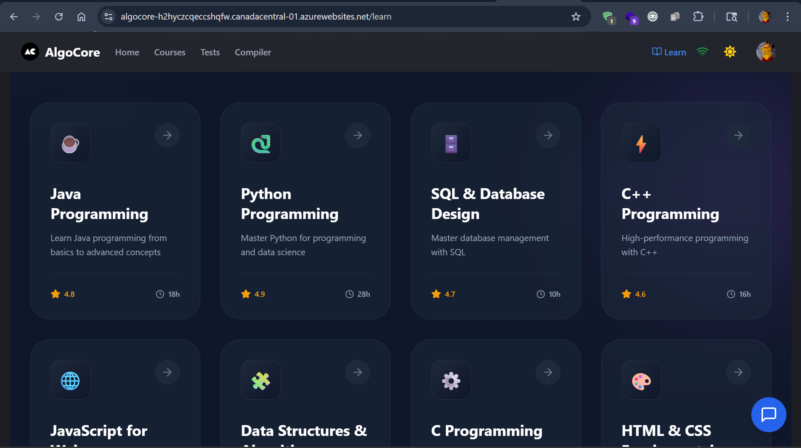 | A categorized view of learning paths and certifications available to the student. |
| **Practice** | 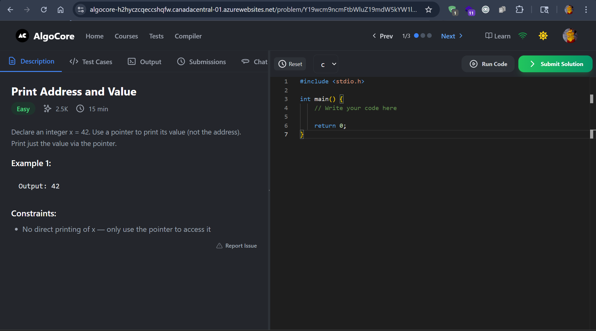 | A focused environment for solving algorithmic challenges before taking formal assessments. |
| **Online Compiler**| 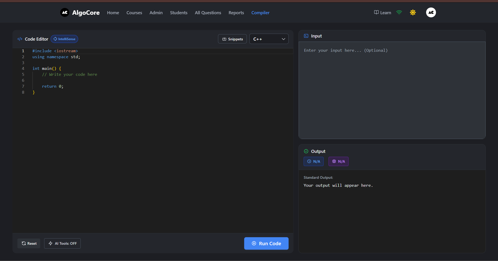 | A powerful IDE-like interface with syntax highlighting, standard input support, and real-time execution outputs. |

### 6.2. Admin Dashboard
The Admin Dashboard provides comprehensive control over the entire platform's data and security.

#### Test & Question Management
| Feature | Preview | Detail |
| :--- | :--- | :--- |
| **Manage Tests** | 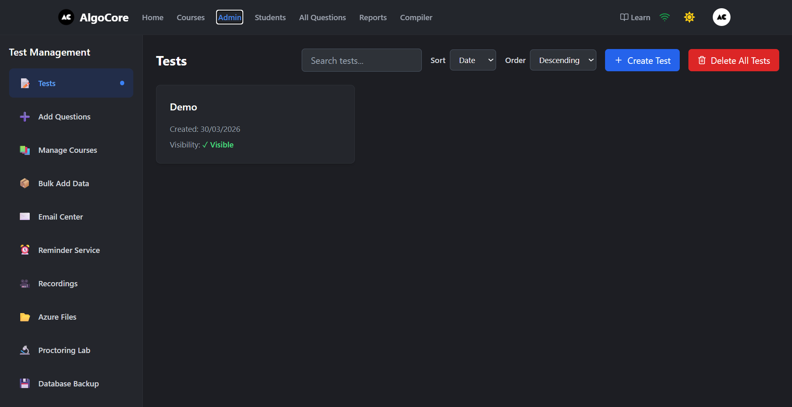 | List and control all active and archived tests. Admins can toggle visibility and proctoring settings here. |
| **Add Questions** | 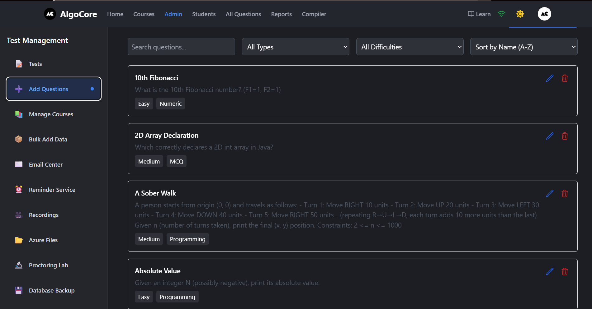 | A comprehensive editor for creating MCQ, MSQ, and complex coding questions with hidden test cases. |
| **Bulk Import** | 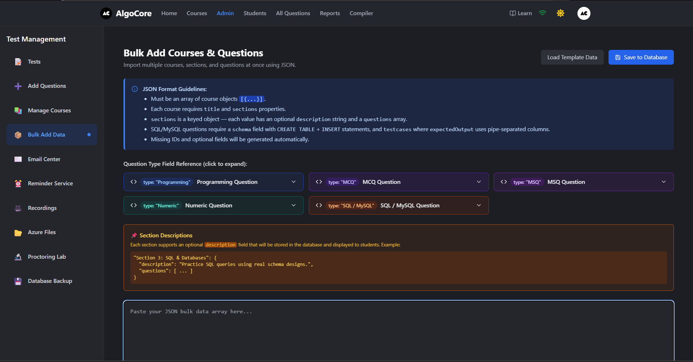 | Speed up content creation by importing questions in bulk using structured formats. |

#### Real-time Monitoring & Proctoring
| Feature | Preview | Detail |
| :--- | :--- | :--- |
| **Proctoring Lab**| 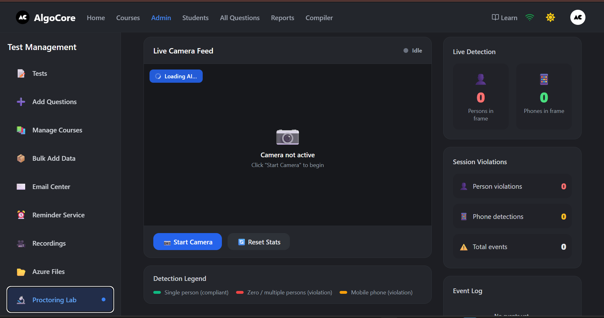 | The central monitoring hub. View live streams of all active students and receive instant alerts on potential violations. |
| **Recordings** | 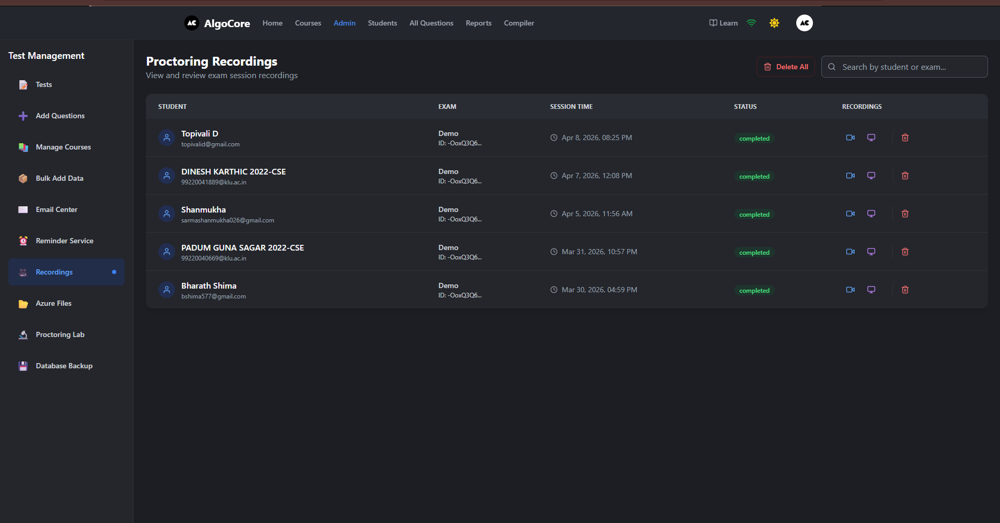 | Post-exam review system for video evidence. Recordings are securely stored and can be reviewed at any time. |
| **Tracking** | 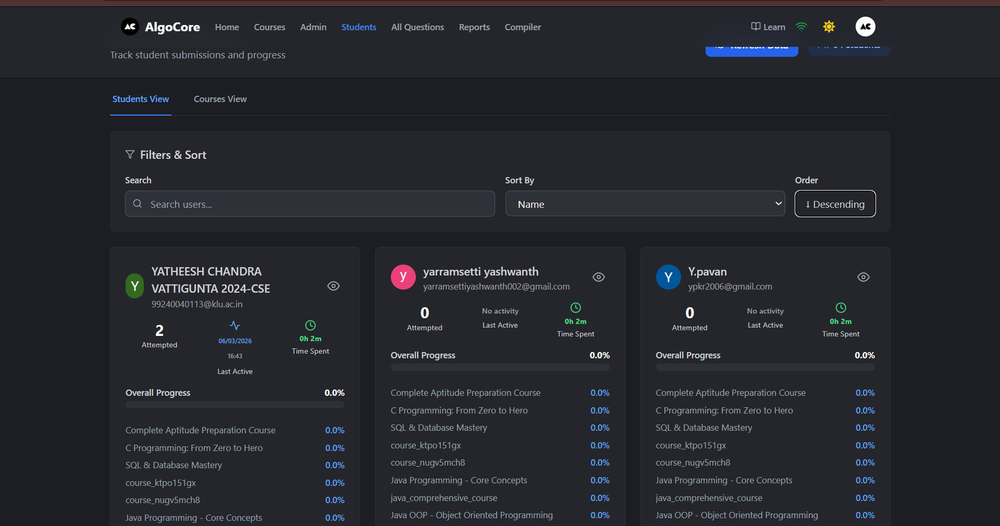 | Monitor student progress through the test in real-time, including which questions they've completed. |

#### Communication & Reporting
| Feature | Preview | Detail |
| :--- | :--- | :--- |
| **Email Center** | 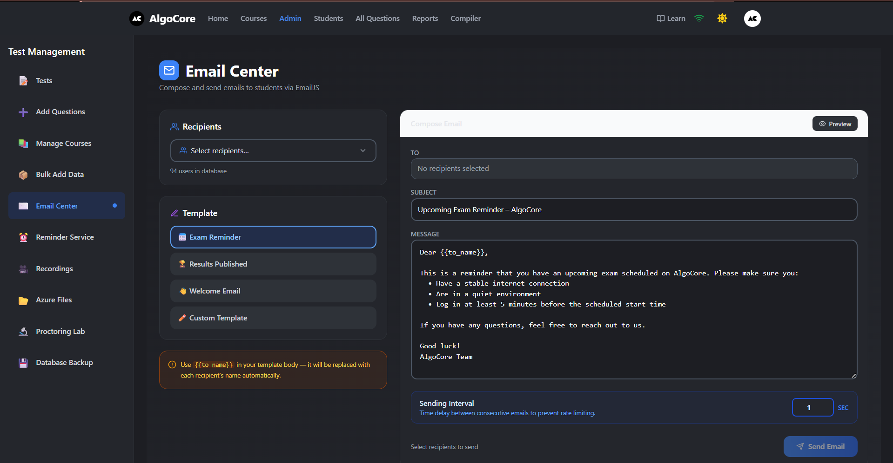 | Send results, credentials, or manual notifications to students directly from the dashboard. |
| **Reminders** | 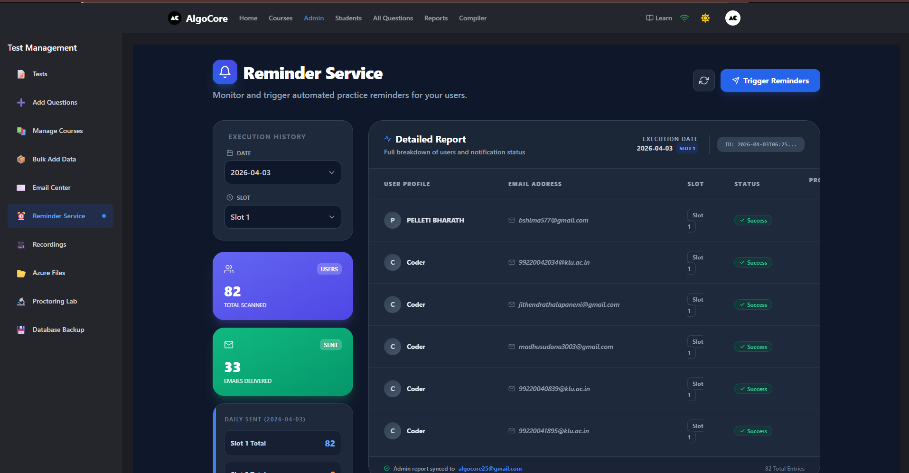 | Schedule and send automated reminders for upcoming test sessions to ensure high attendance. |
| **User Reports** | 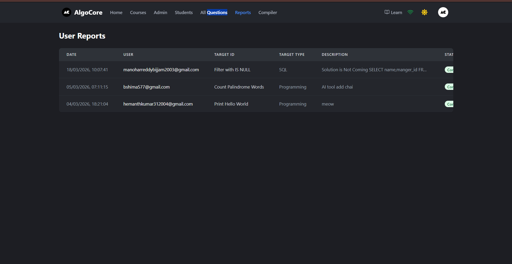 | Generate detailed performance reports and analytics for individual students or entire batches. |

#### Infrastructure
| Feature | Preview | Detail |
| :--- | :--- | :--- |
| **Courses Admin** | 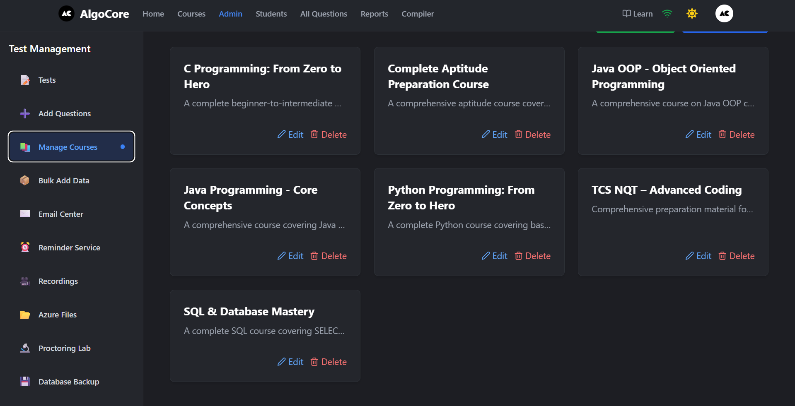 | Create and manage the curriculum structure and learning modules. |
| **Cloud Storage** | 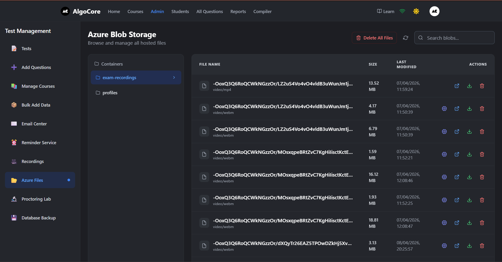 | Integrated view of Azure Blob Storage containers for managing system assets and user data. |

---

## 7. Development Workflow
1. **Adding a Question Type**: Update `src/views/Exam/DynamicExam.jsx` and the Admin `Questions.jsx` components.
2. **Modifying AI logic**: Adjust prompts or endpoints in the Runner service and update `src/views/api.js`.
3. **Storage Changes**: Update `src/utils/azureStorage.js` and the corresponding proxy route in `src/app/api/proxy-blob`.

## 9. Page-wise Data Requirements (Firebase & State)

This section details the specific Firebase Realtime Database paths and keys required for each page to function.

### 9.1. Student Portal

#### Login & Auth (`/login`)
- **Authentication**: `Firebase Auth` provider (Google or Email/Password).
- **Required Path**: `/Users/{uid}`
  - **Required Keys**: `role` (to redirect to `/admin` or `/dashboard`), `name`, `profilePhoto`.

#### Dashboard & Course List (`/dashboard`)
- **Required Path**: `/Exam`
  - **Logic**: Filters for tests where user uid is in the `Eligible` list or test is `isVisible: true`.
- **Required Path**: `/Courses`
  - **Required Keys**: `courseName`, `modules`, `instructor`.

#### Dynamic Exam Engine (`/exam/{testId}`)
- **Required Path**: `/Exam/{testId}`
  - **Keys**: `questions` (the full question list), `duration`, `proctorSettings`.
- **Write Path**: `/ExamSubmissions/{testId}/{uid}`
  - **Keys**: `answers`, `status` (started/submitted), `lastSynced`.
- **Write Path**: `/LiveProctoring/{testId}/{uid}`
  - **Keys**: `violations` (array), `lastHeartbeat`.

#### User Profile (`/profile`)
- **Required Path**: `/Users/{uid}`
  - **Keys**: `profilePhoto`, `bio`, `contact`.
- **Required Path**: `/Marks`
  - **Logic**: Joins with submission data to show history of test percentages and ranks.

---

### 9.2. Admin Dashboard

#### Test Management (`/admin/tests`)
- **Required Path**: `/Exam`
  - **Function**: Full list view with toggle for `isVisible` and `proctoring` status.

#### Question Editor (`/admin/questions`)
- **Write Path**: `/Exam/{testId}/questions/{questionId}`
  - **Structure**: Varies by type (`mcq`, `msq`, `coding`, `sql`).
- **Required Path**: `/Courses`: To populate selection dropdowns for question tagging.

#### Proctoring Lab (`/admin/proctoring`)
- **Required Path**: `/LiveProctoring/{testId}`
  - **Sync**: Listens for child updates to show real-time violation logs and video/screen stream URLs.
- **Required Path**: `/presence`
  - **Status**: Maps `{uid}` to `online: boolean`.

#### Results & Analytics (`/admin/reports`)
- **Required Path**: `/Marks/{testId}`
  - **Keys**: `totalScore`, `breakdown`.
- **Required Path**: `/Users`: To resolve student UIDs to names and emails for CSV export.

---

## 10. Detailed File & Folder Explanation

### 10.1. App Router (`/src/app`)
The core routing and server-side logic of the application.
- **`layout.jsx`**: The root layout wrapping the entire app. It includes global CSS (`src/index.css`) and common metadata.
- **`providers.jsx`**: A client-side component that initializes and wraps the application with all React Context providers (`AuthContext`, `ThemeContext`).
- **`page.jsx`**: The landing page of the application (`/`).
- **`api/`**: Contains Next.js Route Handlers (API endpoints) for backend tasks like Azure Blob management, FFmpeg conversions, and database migrations.
- **`admin/`, `login/`, `profile/`, etc.**: Directory-based routing. Each folder contains a `page.jsx` (or nested routes) defining the UI for that specific path.

### 10.2. Global State (`/src/context`)
Centralized state management using React Context.
- **`AuthContext.jsx`**: The most critical context. It handles login/logout, persists user sessions, checks for unauthorized access, and maintains the proctoring heartbeat.
- **`ThemeContext.jsx`**: Manages the application's visual theme (Light/Dark mode) and persists user preferences.

### 10.3. Feature Logic (`/src/views`)
Contains the heavy lifting for page-specific business logic. Unlike simple components, views are often large and manage complex local states.
- **`Admin/`**: Sub-components and pages for the administrator dashboard, including test management and real-time monitoring.
- **`Exam/`**: Houses the dynamic exam engine. It decides which question type to render (MCQ, SQL, Coding) based on the test configuration.
- **`api.js`**: The primary service layer for client-side API calls to the external AlgoCore Runner service, handling code execution requests and AI tasks.
- **`constants.js`**: Stores static configuration data, such as supported languages and default proctoring settings.

### 10.4. UI Components (`/src/components`)
Reusable React components categorized by their scope.
- **`Navbar.jsx`**: Responsive navigation bar with role-aware links and profile dropdowns.
- **`FloatingChatbot.jsx`**: A persistent AI assistant that provides support to users.
- **`ExamNotificationBanner.jsx`**: Displays critical alerts (e.g., remaining time, proctoring warnings) during active tests.
- **`SkeletonLoader.jsx`**: Reusable loading states for various UI sections.

### 10.5. Utility Services (`/src/utils`)
Stand-alone helper functions and service abstractions.
- **`emailService.js`**: Logic for sending automated emails (results, enrollment confirmations) via external SMTP or API services.
- **`azureStorage.js`**: Helpers for interacting with Azure Blob Storage for photo and video uploads.
- **`languageUtils.js`**: Utility for mapping language IDs to their respective editor configurations (monaco-editor) and runner identifiers.

### 10.6. Maintenance Scripts (`/scripts`)
Dedicated scripts for DevOps and database management.
- **`backup.mjs`**: A Node.js (ESM) script designed to be run periodically. It fetches the latest data from Firebase Realtime Database and synchronizes it into structured tables in Azure SQL Database.

### 10.7. Documentation Assets (`/images`)
- Stores high-quality screenshots and visual references of the application's interface (e.g., `admin_proctoring_lab.png`, `online_compiler.png`). These are used for technical guides, user manuals, and repository documentation.

---
*Created by AlgoCore Engineering Team*
